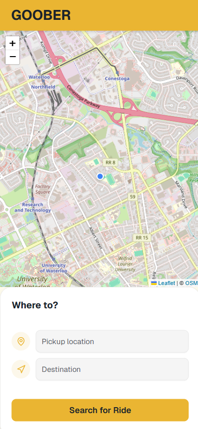

# 🧭 Guber – Coordinates & Fare Calculation API

A modular microservice forming the **Guber (Uber Clone)** backend system.  
This service provides geocoding, routing, live location tracking, and fare estimation via REST APIs.  
Built with **C# (.NET 8)**, using **OpenStreetMap (Nominatim)** for geocoding and **OSRM** for route and distance estimation.

---

## Features

- Address → Coordinates (Geocoding)
- Distance, duration & polyline route calculation
- Decoded route directions array (`{ lat, lon }[]`)
- Fare calculation with base and per-km rates
- Real-time driver and user location tracking
- Lightweight health check endpoint
- JSON-based REST responses consumable by any frontend or service

---

## Technology Stack

| Component | Technology |
|------------|-------------|
| Language | C# (.NET 8) |
| Routing Engine | OSRM (Open Source Routing Machine) |
| Geocoding | OpenStreetMap Nominatim |
| Hosting | ASP.NET Core Web API |
| Testing | xUnit + HttpClient integration tests |
| Build | GitHub Actions CI/CD |

---
## Demo GUI Screenshots


{width=250px} {width=250px}

<!--
 
 -->


---

## Getting Started

### 1️ Prerequisites
- [.NET 8 SDK](https://dotnet.microsoft.com/download)
- Internet connection (for external API requests)
- IDE (Visual Studio 2022 / VS Code)

### 2️ Clone & Run

``` bash
git clone https://github.com/R-umaria/guber-live-tracking
cd guber-live-tracking/Guber.CoordinatesApi
dotnet restore
dotnet run
```
Open your browser at
`` http://localhost:5157/swagger ``
to explore all endpoints.

## API Endpoints (v1.3.0)
### 🔹 Health
|Method|	Endpoint|	Description|
|------------|-------------|------------|
|GET	|/health	|Simple service health-check. |Returns 200 OK when API is live.|


### 🔹 Geocoding
|Method|	Endpoint|	Description|
|------------|-------------|------------|
|GET|	/api/geocode?query=ADDRESS	|Converts a textual address into geographic coordinates.|

#### Query Parameters
|Name|	Type|	Description|
|------------|-------------|------------|
|query  |   string  |   Address to geocode.|

#### Response Example

```json
{
  "latitude": 43.4723,
  "longitude": -80.5449,
  "displayName": "Conestoga College, Waterloo, ON"
}
```

### 🔹 Routing
|Method|	Endpoint|	Description|
|------------|-------------|------------|
|POST|	/api/route|	Calculates driving distance, duration, polyline, and decoded route points between two coordinates.|

#### Request Body

```json
{
  "startLat": 43.4723,
  "startLon": -80.5449,
  "endLat": 43.4246,
  "endLon": -80.4389
}
```
#### Response

```json
{
  "distanceKm": 12.34,
  "durationMinutes": 22.5,
  "polyline": "string",
  "directions": [
    { "lat": 43.4723, "lon": -80.5449 },
    { "lat": 43.4745, "lon": -80.5432 }
  ]
}
```

### 🔹 Fare
|Method|	Endpoint|	Description|
|------------|-------------|------------|
|POST|	/api/fare|	Calculates total fare based on trip distance.|

#### Request Body

```json
{ "distanceKm": 12.34 }
```

#### Response

```json
{
  "baseFare": 4.25,
  "perKm": 1.70,
  "distanceKm": 12.34,
  "totalFare": 24.26
}
```

### Formula

```makefile

Fare = Base Fare + (Distance × Rate per Km)
Example: 4.25 + (12.34 × 1.7) = $25.23
```

### 🔹 Estimate
|Method|	Endpoint|	Description|
|------------|-------------|------------|
|POST|	/api/estimate|	Converts pickup & destination addresses into coordinates, computes route, distance, duration, fare, and polyline.|

#### Request Body

```json
{
  "pickupAddress": "108 University Ave. Waterloo",
  "destinationAddress": "Fairview Mall, Kitchener"
}
```

#### Response Example

```json
{
  "pickupAddress": "108 University Ave. Waterloo",
  "destinationAddress": "Fairview Mall, Kitchener",
  "pickupLat": 43.4723,
  "pickupLon": -80.5449,
  "destinationLat": 43.4246,
  "destinationLon": -80.4389,
  "type": "standard",
  "pet": true,
  "distanceKm": 12.34,
  "durationMinutes": 22.5,
  "fare": 24.26,
  "polyline": "string",
  "directions": [
    { "lat": 43.4723, "lon": -80.5449 },
    { "lat": 43.4745, "lon": -80.5432 }
  ]
}
```

New in v1.3.0: directions array now returns decoded coordinates of the full route.
A future ?includeDirections=false flag will allow trimming large payloads.

### 🔹 Live Location
|Method|	Endpoint|	Description|
|------------|-------------|------------|
|POST|	/api/liveLocation/driver|	Updates a driver’s live position.|
|POST|	/api/liveLocation/user|	Updates a user’s live position.|
|GET|	/api/lastLocation|	Fetches last known coordinates for a given entityType and entityId.|

#### POST Request Example

```json
{
  "entityId": "D001",
  "lat": 43.4723,
  "lon": -80.5449,
  "timestamp": "2025-11-11T15:57:46.296Z"
}
```

#### GET Example

```bash
/api/lastLocation?entityType=driver&entityId=D001
```
#### Response

```json
{
  "entityId": "D001",
  "lat": 43.4723,
  "lon": -80.5449,
  "timestamp": "2025-11-11T15:57:46.302Z"
}
```

## 🔹 Weather (Sample Demo)
|Method|	Endpoint|	Description|
|------------|-------------|------------|
|GET|	/WeatherForecast|	Default ASP.NET sample endpoint for environment verification.|

## Schemas Summary
|DTO|	Fields|
|------------|-------------|
|CoordinatePoint|	lat: number, lon: number|
|EstimateRequest|	pickupAddress, destinationAddress|
|EstimateResponse|	pickupLat, pickupLon, destinationLat, destinationLon, distanceKm, durationMinutes, fare, polyline, directions[]|
|RouteRequest|	startLat, startLon, endLat, endLon|
|RouteResponse|	distanceKm, durationMinutes, polyline, directions[ ]|
|FareRequest|	distanceKm|
|FareResponse|	baseFare, perKm, distanceKm, totalFare|
|LiveLocationUpdate|	entityId, lat, lon, timestamp|
|LastLocationResponse|	entityId, lat, lon, timestamp|
|WeatherForecast|	date, temperatureC, temperatureF, summary|

## Example Workflow
1. Estimate Trip

```bash
POST /api/estimate
```
→ Returns full route, fare, and polyline.

2. Simulate Driver

```bash
POST /api/liveLocation/driver
```

3. Track Last Location

```bash
GET /api/lastLocation?entityType=driver&entityId=D001
```

## What’s New in v1.3.0
* Added decoded directions array in /api/route and /api/estimate

* Updated tests to validate route coordinates

* Preparing support for ?includeDirections=false flag

## Contributors
 Rishi Umaria · Brian Nguyen

----

## License
MIT License © 2025 Guber Project
See LICENSE for details.
